<p align="center">
  
</p>

<h1 align="center">🛡️ VeriFind</h1>

<p align="center">
<b>Decentralized Device Ownership & Verification Platform</b><br>
Creating an immutable ownership history for physical devices using Blockchain, QR Verification, and IPFS.
</p>

<p align="center">


</p>

---

# 📑 Table of Contents

- [Overview](#overview)
- [Problem Statement](#problem-statement)
- [Solution](#solution)
- [Demo](#demo)
- [Features](#features)
- [Ownership Lifecycle](#ownership-lifecycle)
- [System Architecture](#system-architecture)
- [Verification Workflow](#verification-workflow)
- [Ownership Transfer](#ownership-transfer)
- [Security Model](#security-model)
- [Threat Model](#threat-model)
- [Screenshots](#screenshots)
- [Tech Stack](#tech-stack)
- [Installation](#installation)
- [Future Improvements](#future-improvements)
- [Team](#team)

---

# Overview

VeriFind is a decentralized ownership verification platform that creates an immutable ownership history for electronic devices using blockchain technology.

Every registered device receives a cryptographically verifiable identity that can only be controlled by the wallet currently owning the asset. Before purchasing a second-hand device, buyers can instantly verify whether it is:

- ✅ Legitimately owned
- 🚨 Reported Lost
- 🚨 Reported Stolen
- 🔄 Already transferred to another owner

Unlike traditional databases where ownership records can be modified, VeriFind stores ownership history on-chain, providing transparent and tamper-resistant verification.

---

# Problem Statement

Millions of smartphones and electronic devices are stolen every year and sold through informal second-hand markets.

Buyers usually have no reliable way to verify whether the seller actually owns the device.

This fuels black-market resale because stolen devices remain easy to sell.

Current solutions depend on centralized databases controlled by manufacturers and often cannot provide transparent ownership history.

---

# Solution

VeriFind introduces a decentralized ownership protocol.

During the initial device setup, the purchaser scans the manufacturer-issued QR code to cryptographically claim first ownership.

Ownership becomes permanently linked to the owner's blockchain wallet until explicitly transferred.

Anyone can scan a device QR code to verify whether the device is:

- Registered
- Lost
- Stolen
- Legitimately owned

Only the blockchain-verified owner gains administrative privileges.

Everyone else is limited to read-only verification.

---

# Demo

<p align="center">


</p>

---

# 🚀 Features

## Ownership Verification

- QR based verification
- Blockchain ownership validation
- Immutable ownership history
- ERC-721 NFT ownership

---

## Manufacturer Registration

- Manufacturer mints new device
- Generates unique QR
- Creates first ownership record

---

## Device Management

- Report Lost
- Report Stolen
- Recover Device
- Transfer Ownership

---

## Blockchain

- Solidity Smart Contracts
- ERC-721 Ownership Tokens
- Immutable Ledger
- Gasless Meta Transactions

---

## Storage

- IPFS image storage
- Immutable metadata
- MongoDB caching
- Fast user authentication

---

## 🔐 Security

- Wallet authentication
- Read-only verification mode
- Ownership validation
- Immutable ownership chain

---

# Ownership Lifecycle

```text
🏭 Manufacturer
        │
Generate QR
        │
        ▼
📦 First Registration
        │
        ▼
👤 Owner Verification
        │
        ▼
🔄 Ownership Transfer
        │
        ▼
🛡 Public Verification
```

---

# 🏗️ System Architecture

<p align="center">

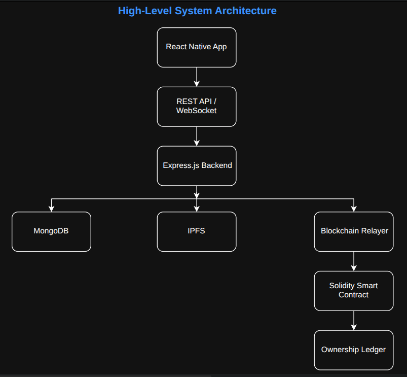

</p>

The React Native client communicates with the Express backend through REST APIs.

The backend synchronizes data across:

- MongoDB
- IPFS
- Blockchain Relayer

Ownership state is ultimately maintained by Solidity smart contracts while MongoDB serves as a high-speed cache for application queries.

---

# Device Registration & Ownership

<p align="center">

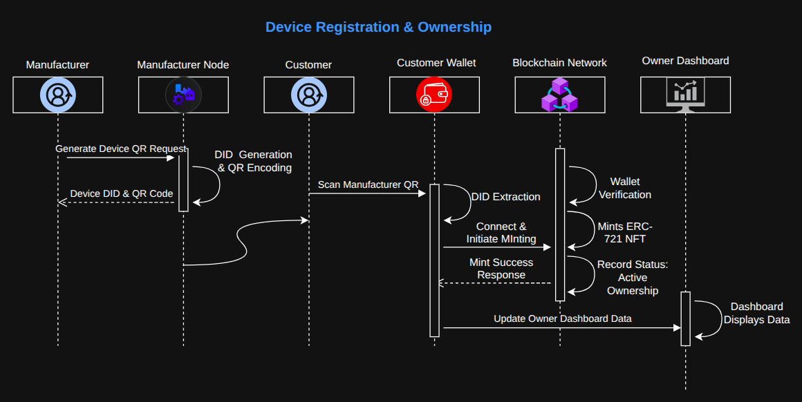

</p>

Manufacturers generate a unique QR code for each device.

The purchaser scans this QR during device setup.

Ownership is minted as an ERC-721 token and permanently linked to the purchaser's blockchain wallet.

---

# Verification Workflow

<p align="center">

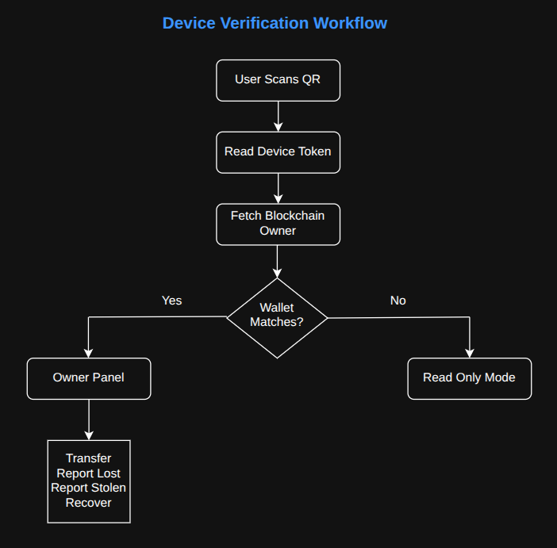

</p>

Whenever a QR code is scanned:

- Device token is extracted
- Blockchain owner is fetched
- Wallet ownership is verified

If the connected wallet matches the blockchain owner:

- Transfer Ownership
- Report Lost
- Report Stolen
- Recover Device

Otherwise, the user receives read-only device information.

---

# Ownership Transfer

<p align="center">

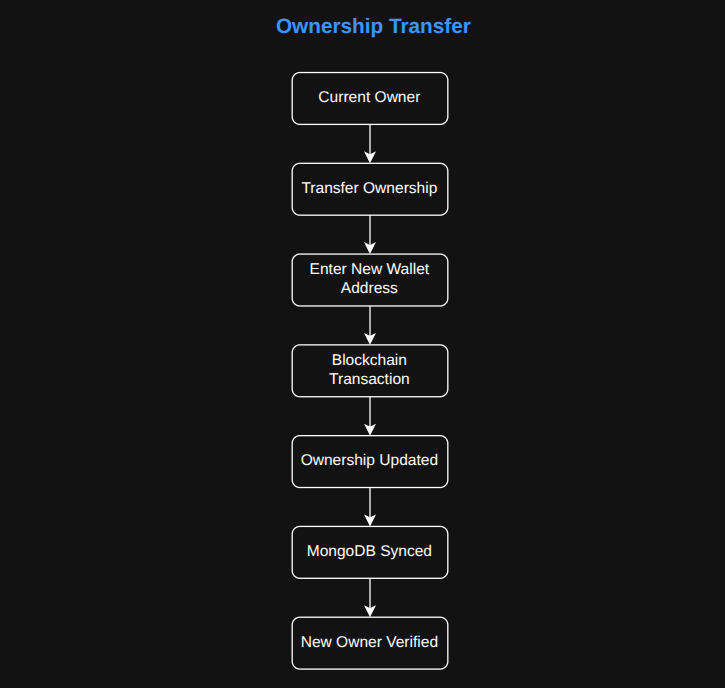

</p>

Ownership transfer is performed entirely on-chain.

Once transferred:

- Previous owner immediately loses administrative privileges.
- New owner becomes the only verified administrator.
- MongoDB synchronizes the updated ownership for fast application access.

---

# Security Model

| Scenario | Result |
|------------|----------|
| Wallet matches blockchain owner | Full administrative access |
| Wallet mismatch | Read-only mode |
| Device reported stolen | BOLO alert generated |
| Device reported lost | Public verification updated |
| Ownership transferred | Previous owner loses privileges |
| Device recovered | Ownership remains intact while status is updated |

---

# Threat Model

| Threat | Mitigation |
|------------|-------------------------|
| Selling stolen devices | Blockchain ownership verification |
| Fake ownership claims | Wallet authentication |
| Unauthorized transfer | Only current owner's wallet can transfer ownership |
| Ownership tampering | Immutable blockchain ledger |
| Metadata modification | IPFS immutable storage |
| Device cloning | Unique manufacturer-issued QR identity |
| Database compromise | Blockchain remains source of truth |

---

# 📱 Screenshots

## Login

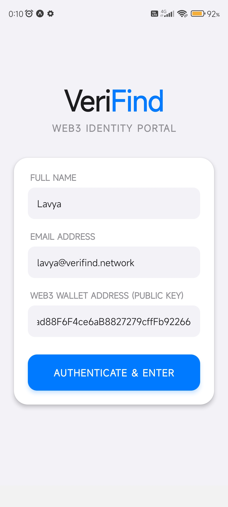

---

## Dashboard

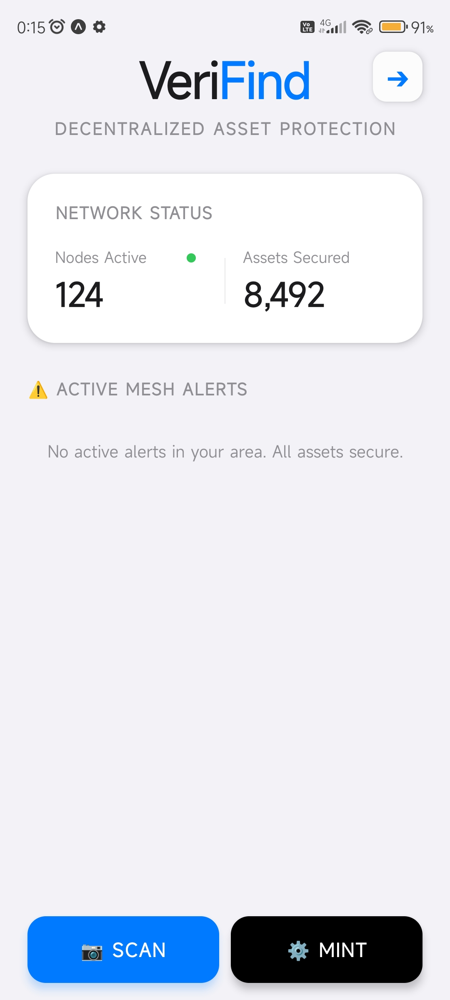

---

## Manufacturer Dashboard

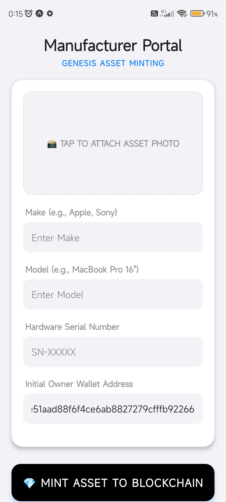

---

## QR Generation

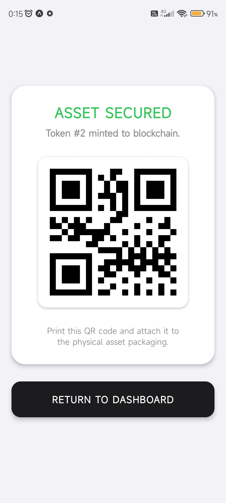

---

## Owner Dashboard

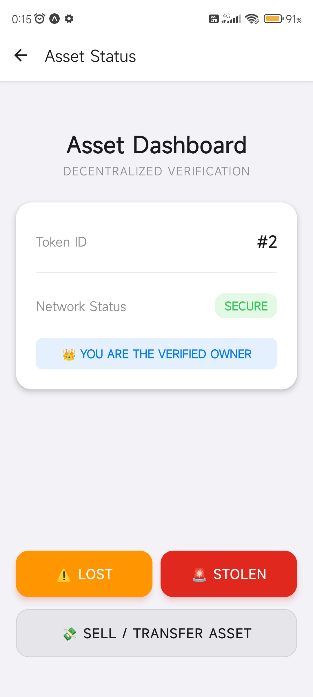

---

## Read Only Mode

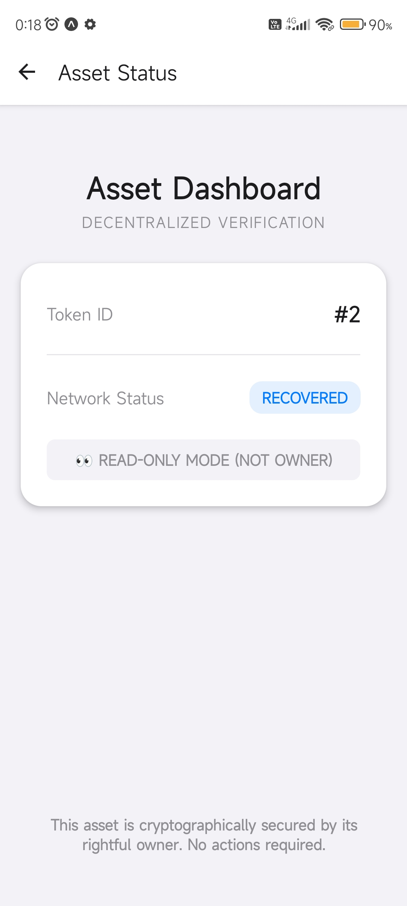

---

## Transfer Ownership

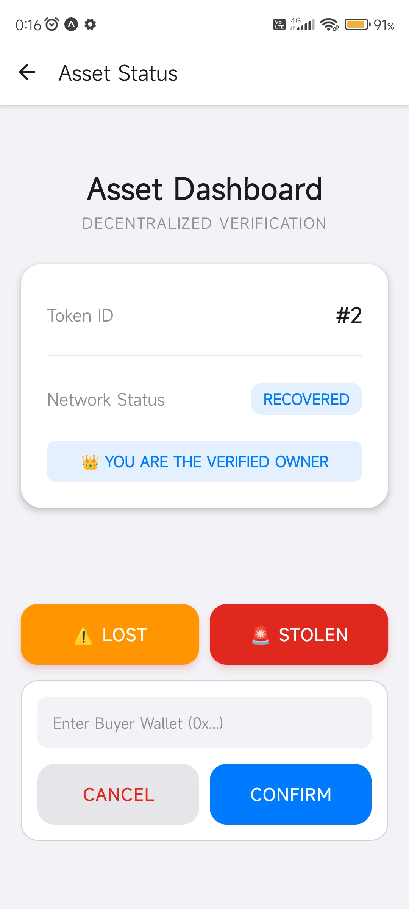

---

## BOLO Alert

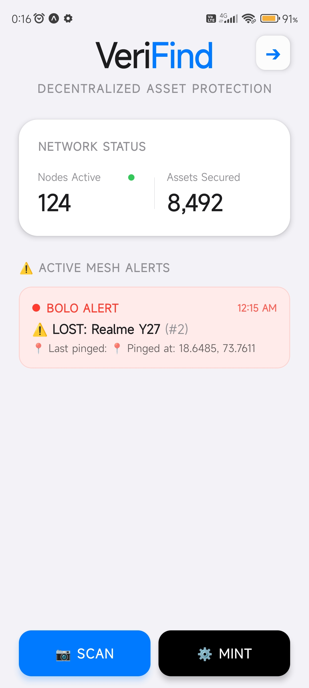

---

# 🛠️ Tech Stack

| Layer | Technologies |
|------------|-------------------------------|
| Mobile | React Native, Expo |
| Backend | Node.js, Express.js |
| Database | MongoDB |
| Blockchain | Solidity, Hardhat |
| Wallet | Ethers.js |
| Storage | IPFS (Pinata) |
| Authentication | Wallet-based Identity |

---

# ⚙️ Installation

## Clone Repository

```bash
git clone https://github.com/lavyajn/VeriFind

cd verifind
```

---

## Blockchain

```bash
cd blockchain

npm install

npx hardhat node
```

Deploy Contract

```bash
npx hardhat run scripts/deploy.js --network localhost
```

---

## Backend

```bash
cd backend

npm install

node server.js
```

Create a `.env`

```env
PORT=5000

MONGODB_URI=

PINATA_API_KEY=

PINATA_SECRET_API_KEY=

RPC_URL=

PRIVATE_KEY=

CONTRACT_ADDRESS=
```

---

## Frontend

```bash
cd frontend

npm install

npx expo start
```

Create

```env
EXPO_PUBLIC_BACKEND_URL=http://YOUR_IP:5000/api
```

---

# 🔮 Future Improvements

- Native Android/iOS integration
- Manufacturer partnerships
- IMEI verification
- NFC ownership verification
- Push notification service
- Law enforcement portal
- Multi-device ownership dashboard
- QR display from device lock screen
- Geo-fenced recovery notifications
- Decentralized identity (DID) support

---

# 👥 Team

- Harshil Bohra
- Prathmesh Alkute
- Lavya Jain

---

<p align="center">

Built to create a safer second-hand electronics ecosystem through decentralized ownership verification.

</p>